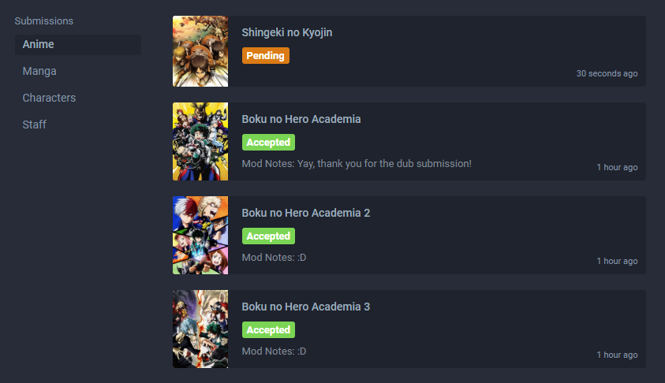

# Introducción

### Prólogo

Agregar o modificar una entrada en AniList es una tarea fácil. El objetivo principal es asegurarse de que los datos sean precisos y lo más completos posible para ese momento. Todas las secciones del formulario están formateadas de manera similar y tienen útiles consejos útiles para ayudarte.

## Agregar Nuevas Entradas

Se pueden enviar nuevas entradas utilizando estos enlaces:  
**Anime**: [https://anilista.com/edit/anime/new](https://anilista.com/edit/anime/new)  
**Manga**: [https://anilista.com/edit/manga/new](https://anilista.com/edit/manga/new)

Nuevos **Personajes** and **Personas** solo se pueden crear a través de las subpáginas de los formularios de anime y manga' [Personaje](./submissions.html#characters) y [Persona](./submissions.html#staff). Esto es lo mismo si estás enviando una nueva entrada o editando una existente.

## Edición de entradas

Las entradas existentes de anime y manga se pueden editar usando el botón de edición en la **parte inferior izquierda** de su página..

Las entradas de personas y personajes existentes se pueden editar usando el botón de icono de edición en la **esquina superior derecha** de su página.

## Aprobación de Envío

Cuando un usuario proporciona un envío, se someterá a un proceso de revisión en el que un moderador puede aprobar o rechazar las adiciones y/o cambios realizados. Es extremadamente útil proporcionar tantas [fuentes](./criteria.html#sourcing) como sea posible para confirmar la información que deseas enviar.

::: advertencia Ten en cuenta que AniLista no maneja todas las entradas de la misma manera que lo hacen otros sitios.
Ejemplos:  
[Episodio 0s y Prólogos](./criteria.html#episode-0-s-and-prologues) solo se colocan en una entrada independiente si se emitieron en un formato diferente de la misma serie.

Los episodios de [Resumen](./criteria.html#recaps) no siempre están incluidos.

AniLista tiene [relaciones](./submissions.html#relations) adicionales. Adaptaciones de etiquetado entre todos los formatos \(anime, manga, y novela ligera\) también se tratan de la misma manera.
:::

Después de realizar un envío, podrá ver el estado de sus envíos, además de recibir comentarios y preguntas de cualquier moderador que trabaje en él si es necesario.

Si tiene alguna consulta en relación con el envío o actualización de contenido en el sitio, no dude en preguntar a un [moderator](./#moderator-list) sobre el [website](http://anilist.co) o en el [Discord](https://discord.gg/2J5nqqZ).

::: tip
Es _**muy recomendable**_ que lea tanto el [Checklist](./criteria.html#checklist) y [Animated](./criteria.html#animated-media) y [Written Media](./criteria.html#written-media) en la secciones de especificación antes de cualquier envío, o al menos secciones relevantes dentro de él.

Las últimas secciones establecen lo que _**es**_ y _**no**_ aceptado en la base de datos y proporciona muchos consejos útiles.
:::

::: Advertencia por favor recorda
Este sitio es _**solo**_ para obras de origen japonés, coreano, chino y taiwanés, como se especifica en '[Country of Origin](./submissions.html#country-of-origin).'
:::

## Lista de Moderadores

::: tip
No dudes en ponerse en contacto con un moderador para obtener ayuda y asesoramiento a través del [sitio web](http://anilista.com/) o en [Discord](https://discord.gg/2J5nqqZ) \#submission-support .

Sin embargo, no les dés un título y esperes que hagan todo el trabajo por ti.
:::

#### Anime

| Nombre                                            | Rol             |
| :------------------------------------------------ | :-------------- |
| [Ivan](http://anilista.com/user/Ivan)             | Principal Anime |
| [Frans](http://anilista.com/user/Frans)           | Anime           |

#### Manga

| Nombre                                        | Rol                  |
| :-------------------------------------------- | :------------------- |
| [Ivan](http://anilista.com/user/Ivan)         | Principal Manga      |
| [Frans](https://anilista.com/user/Frans)      | Manga                |

#### Otros Roles

| Nombre                                         | Rol                    | Rol                       | Rol                 |
| :--------------------------------------------- | :---------------------- | :----------------------- | :------------------ |
| [Frans](http://anilista.com/user/Frans)        | Principal Desarrollador |                          | Comunidad           |
| [Ivan](http://anilista.com/user/Ivan)          |                         | Principal Redes Sociales | Principal Comunidad |
