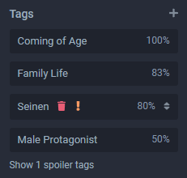
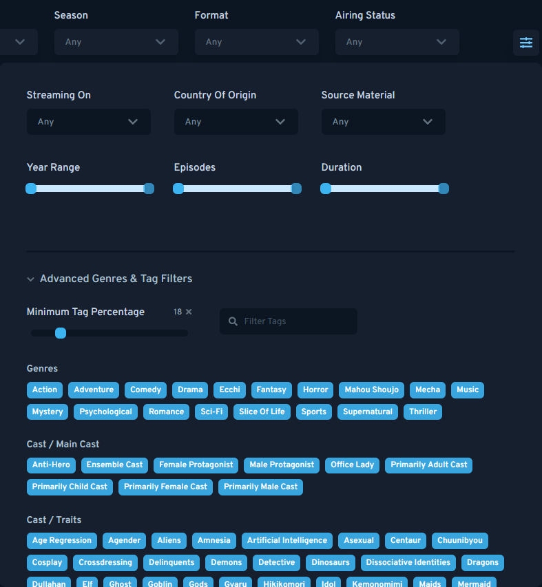

## Gestión de Etiquetas

La lista de etiquetas se puede ver en la parte inferior izquierda de cada página de entrada.

Las etiquetas no forman parte del sistema de envío, pero siguen siendo muy importantes. Si envías nuevas entradas, se agradecería enormemente si pudieras agregar etiquetas una vez que se aprueba la entrada, marcando algunas como spoilers si es necesario.

Las etiquetas para cada entrada son completamente administradas por el usuario, y todos los usuarios pueden agregar etiquetas y votar sobre su relevancia para el trabajo en cuestión. Luego, los resultados se pueden filtrar en la sección "Explorar" del sitio web.

Si desea enviar una nueva etiqueta, todo lo que tienes que hacer es escribir el nombre y enviarla; luego, será revisada y aprobada o denegada.

::: tip
Las etiquetas se pueden marcar como spoiler con el icono del signo de exclamación o eliminarse con el icono de la papelera. Esta función no está disponible para usuarios estándar.
:::

::: advertencia
El poder del voto de cada usuario se limita para restringir el abuso. Si crees que las etiquetas se han agregado incorrectamente, envíe una edición a la entrada donde simplemente comentes en la caja de [Notas y Fuentes de Envío](./submissions.html#submission-sources-notes) por qué deben eliminarse las etiquetas. 
:::

## Solicitudes de Etiquetas

En su mayor parte, cualquier etiqueta nueva solicitada por un usuario será discutida entre los moderadores y, a veces, los propios usuarios antes de tomar una decisión sobre si incluirla o no. Idealmente, las etiquetas no deberían ser aquellas que a menudo se consideren subjetivas, como 'moe', y no tan descriptivas como el color de ojos. Examinar la lista de etiquetas es la mejor medida para ver qué tipo de contenido podría aprobarse.

## Lista de Etiquetas

Si usa el botón de filtro en la página [Explorar](https://anilista.com/search/anime) y luego expande la sección 'Géneros Avanzados y Filtros de Etiquetas' obtendrás una lista de etiquetas disponibles, con descripciones al pasar el mouse.

::: tip
Una página dedicada en un diseño de tabla se implementará en una fecha posterior.
:::
